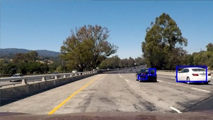
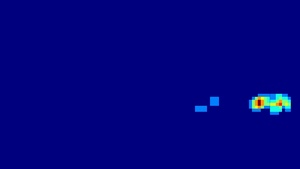
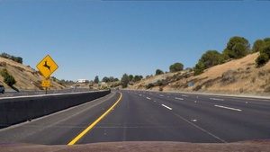
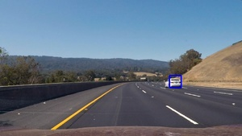
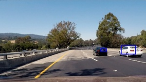
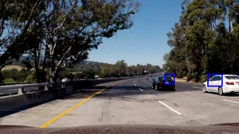

# Vehicle Detection

By Asim Imdad Wagan

## Introduction
In this project, my goal is to create a vehicle detection pipeline using the Histogram of Oriented Gradient based features.
The project is the final project in the Term 1 of the udacity SDC course. 
The complete project pipeline is implemented in the **vehicle.py** file. This script holds a class which performs the 
vehicle detection.

---
### Histogram of Oriented Gradients (HOG)

**Rubric 1 Explain how (and identify where in your code) you extracted HOG features from the training images.
 Explain how you settled on your final choice of HOG parameters.**
 
*Explanation given for methods used to extract HOG features, including which color space was chosen, 
 which HOG parameters (orientations, pixels_per_cell, cells_per_block), and why.*
 
Ans: The HOG are useful features for detecting objects in the images. HOG features were used with the following 
set of parameters.
 
| Param Name     | Value   |
|----------------|---------|
| Color Space    | 'YCrCb' |
| Orient         | 9       |
| Pix per Cell   | 8       |
| Cell Per Block | 2       |
 
 I experimented with other color spaces and orientation but found out after 
 experimentation that these parameters gave the best result.
 
**Rubric 2 Describe how (and identify where in your code) you trained a classifier using your selected 
 HOG features (and color features if you used them).**

*The HOG features extracted from the training data have been used to train a classifier, could be SVM, 
Decision Tree or other. Features should be scaled to zero mean and unit variance before training the classifier.*

1- Feature extraction was performed by the get_hog_features, bin_spatial and color_hist functions.
2- These were combined into the a single feature vector in the extract features function.
3- Scaling was performed with the StandardScaler function available in the sklearn library.
4- Linear Support Vector Classifier was used as it gave us the best accuracy. I have also tried
the RandomForest classifier but abandoned it due to less accuracy. Non Linear SVC was not tried
it could have given better accuracy but it would have also increased the classification time. 
LinearSVC was sufficiently accurate and we were getting accuracy of 99.1% so it was used.
The paramters used were: (C=1.0,  penalty='l2', loss='hinge') which were found to be sufficient after several experiments.

### Sliding Window Search

**Rubric 3 Describe how (and identify where in your code) you implemented a sliding window search. How did 
you decide what scales to search and how much to overlap windows?**

*A sliding window approach has been implemented, where overlapping tiles in each test image are classified as 
vehicle or non-vehicle. Some justification has been given for the particular implementation chosen.*

The sliding window has been implemented in find_cars with overlap of  2 cells sliding at a time. 
Four scales were choosen to scan the image in the confined region based on the scale. The details of it are shown
below:
    scale=[1.0, 1.25, 1.5, 1.75]
    y_start_stop = [[400,496], [400,528], [400,592], [400,656]]

The were choosen based on the scale of the vehicles. It was assumed that farther the vehicle is it will be represented by
a smaller window. Utilizing this information about the problem at hand we identified the four sub region where these vehicles
can appear inside a frame. Then those regions are scanned for potential candidates which are then mapped on a heat map.

**Rubric 4 Show some examples of test images to demonstrate how your pipeline is working. 
How did you optimize the performance of your classifier?**

*Some discussion is given around how you improved the reliability of the classifier i.e., 
fewer false positives and more reliable car detections (this could be things like choice of feature vector, 
thresholding the decision function, hard negative mining etc.)*

 |   
 |   
 |   
 |   
 |   

### Video Implementation

**Rubric 5 Provide a link to your final video output. Your pipeline should perform reasonably well on the 
entire project video (somewhat wobbly or unstable bounding boxes are ok as long as you are identifying 
the vehicles most of the time with minimal false positives.)**

*The sliding-window search plus classifier has been used to search for and identify vehicles 
in the videos provided. Video output has been generated with detected vehicle positions drawn 
(bounding boxes, circles, cubes, etc.) on each frame of video.*

The processed output video is in the file **output.mp4** a gif of the same video is attached below:

 

**Rubric 6 Describe how (and identify where in your code) you implemented some kind of filter 
for false positives and some method for combining overlapping bounding boxes.**

*A method, such as requiring that a detection be found at or near the same position in several subsequent frames,
 (could be a heat map showing the location of repeat detections) is implemented as a means of rejecting false 
 positives, and this demonstrably reduces the number of false positives. Same or similar method used to draw 
 bounding boxes (or circles, cubes, etc.) around high-confidence detections where multiple overlapping detections occur.*

A heatmap based false positive eleimination method is used. A deque was created in the code which
holds the bounding boxes detected by the classifier. These are combined to create a heatmap of the 
all the single images. The maximum size of deque was set around 10 with a threshold of 8 was set.
Any region crossing this threshold was considered as a vehicle.

 |   
 |   
 |   
 |   
 |   

### Discussion

**Rubric 7 Briefly discuss any problems / issues you faced in your implementation of this project. 
Where will your pipeline likely fail? What could you do to make it more robust?**

*Discussion includes some consideration of problems/issues faced, what could be improved about their 
algorithm/pipeline, and what hypothetical cases would cause their pipeline to fail.*

The method discussed here is not state of the art. There are currently techniques available which
can detect the vehicles and other type of objects in real time. A more closer study of those techniques
is required. This include the YOLO algorithm which is a very fast object detector. 

